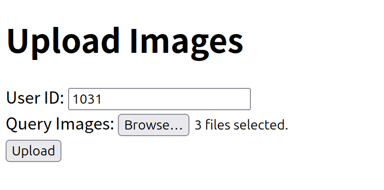
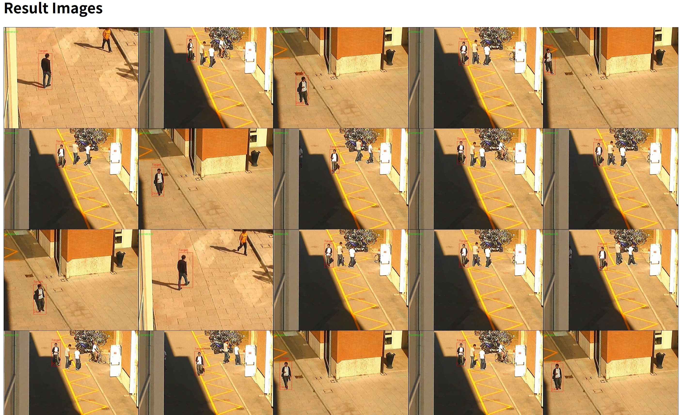

# ReIDFaaS
This is the repository of ReIDFaaS. Before deploying ReIDFaaS, ensure that a **Kafka** cluster, a distributed **NFS**, a **k3s** cluster, and **Knative** have been deployed. The deployment of ReIDFaaS requires the following steps: 

1. Create images for the corresponding functions based on several Dockerfiles in the repository; 
2. Confirm the API addresses of **target-detector**, **feature-extractor**, and **feature-matcher**: **url_va**, **url_fe**, **url_reid**; 
3. Modify the addresses of the function images in the yaml directory. Also, add the addresses of the Kafka cluster nodes, represented by the environment variable **KAFKA_BIND_ENDPOINTS**, for example: "**192.168.10.2:9092|192.168.10.3:9092**"; 
4. Add the environment variables **url_va**, **url_fe** for **move-detector**, and add the environment variable **url-reid** for **front-end**; 
5. Deploy the **pv** and **pvc** in the yaml directory, binding **pv** to **NFS**; 
6. Deploy the functions in the yaml directory, where feature-matcher-batch is the batch version of feature-match

After a successful deployment, binding the move-detector and the camera only requires sending the following message body to the move-detector.

```json
{
    "fps": "",
    "video_id": "",
    "video_address": ""
}
```

When a query needs to be performed on the target, it can be accessed directly in the browser through the front-end.




